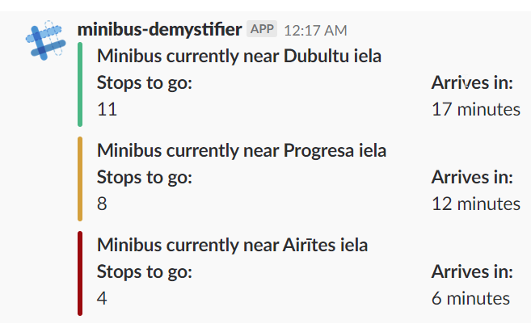

# minibus-demystifier

Demystifies the arrival of minibuses for a desired route and stop. 

Only really supposed to work for Riga/Latvia

You can see the alternative you have to contend with here: http://marsruti.lv/rigasmikroautobusi/

# installing

Right now only really supporting *Python 3.7*

Requirements can be installed via:

`pip install -r requirements.txt`

# how to use

Basic usage is covered in /examples/basic.py

For some advanced usage examples refer to implementation within /slack_app.py 